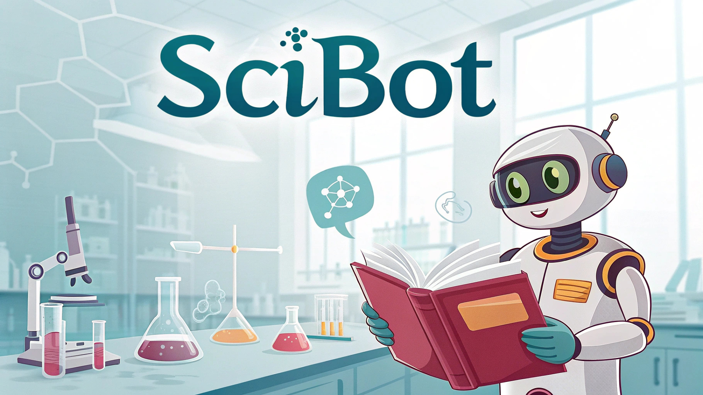

# SciBot - AI Chatbot for Research Paper Understanding 🤖





<!-- PROJECT LOGO -->
<br />
<div align="center">
  <a href="[YOUR_PROJECT_LINK_HERE_IF_ANY]">
    <!--  -->
    <!-- If you have a logo, uncomment the line above and add its path -->
  </a>

  <h3 align="center">SciBot</h3>

  <p align="center">
  An AI-powered chatbot to simplify research paper comprehension and enable interactive exploration of scientific content.
  <br />
  <br />
  <a href="https://github.com/GannaAsaad/Personalized-Chatbot-Project/issues">Report Bug</a>
  ·
  <a href="https://github.com/GannaAsaad/Personalized-Chatbot-Project/issues">Request Feature</a>
</p>

</div>

<!-- TABLE OF CONTENTS -->
<details>
  <summary>Table of Contents</summary>
  <ol>
    <li>
      <a href="#about-the-project">About The Project</a>
      <ul>
        <li><a href="#built-with">Built With</a></li>
      </ul>
    </li>
    <li>
      <a href="#getting-started">Getting Started</a>
      <ul>
        <li><a href="#prerequisites">Prerequisites</a></li>
        <li><a href="#installation">Installation</a></li>
      </ul>
    </li>
    <li><a href="#usage">Usage</a></li>
    <li><a href="#core-functionalities">Core Functionalities</a></li>
    <li><a href="#technical-deep-dive">Technical Deep Dive</a>
        <ul>
            <li><a href="#data-collection-and-preprocessing">Data Collection and Preprocessing</a></li>
            <li><a href="#model-development">Model Development</a></li>
            <li><a href="#advanced-implementation-techniques">Advanced Implementation Techniques</a></li>
        </ul>
    </li>
    <li><a href="#mlops-and-deployment">MLOps and Deployment</a></li>
    <li><a href="#roadmap">Roadmap</a></li>
    <li><a href="#contributing">Contributing</a></li>
   
    <li><a href="#contact">Contact</a></li>
    <li><a href="#acknowledgments">Acknowledgments</a></li>
  </ol>
</details>

<!-- ABOUT THE PROJECT -->
## About The Project

The growing volume and complexity of academic research can make it difficult for students, researchers, and professionals to quickly grasp the key ideas and contributions of a scientific paper. Many struggle with unfamiliar terminology, dense writing, or the time constraints of staying updated with current literature.

SciBot addresses this challenge by providing an AI-powered chatbot that simplifies research paper comprehension and enables interactive exploration of its content. Upload a PDF research paper, and SciBot will automatically extract, organize, and present its contents in a clear, human-readable explanation. Beyond summarization, SciBot features a robust question-answering system, allowing users to ask detailed queries about the paper, with conversational memory for a coherent dialogue experience.

**Key Goals:**
*   Provide simplified, section-wise explanations of research papers.
*   Enable users to ask specific questions about the paper's content.
*   Maintain conversational context for follow-up questions and natural interaction.

### Built With

SciBot leverages a powerful stack of modern AI and web technologies:

*   [![Python][Python.org]][Python-url]
*   [![FastAPI][FastAPI.com]][FastAPI-url]
*   [![LangChain][LangChain.com]][LangChain-url]
*   [![HuggingFace Transformers][HuggingFace.co]][HuggingFace-url]
*   Gemini API (for LLM capabilities)
*   PyMuPDF / PDFPlumber / PyPDF2 (for PDF processing)
*   FAISS (for vector storage and similarity search)
*   HTML5, CSS3, JavaScript (for the frontend)

<!-- GETTING STARTED -->
## Getting Started

To get a local copy up and running, follow these simple steps.

### Prerequisites

Ensure you have the following installed:
*   Python 3.9+
*   pip (Python package installer)
*   A **Gemini API Key** is required. You can obtain one from [Google AI Studio](https://aistudio.google.com/app/apikey).

### Installation

1.  **Clone the repository:**
    ```sh
    git clone https://github.com/GannaAsaad/Personalized-Chatbot-Project.git
    cd Personalized-Chatbot-Project
    ```
2.  **Create and activate a virtual environment (recommended):**
    ```sh
    python -m venv venv
    # On Windows
    venv\Scripts\activate
    # On macOS/Linux
    source venv/bin/activate
    ```
3.  **Install dependencies:**
    ```sh
    pip install -r requirements.txt
    ```
    *(You'll need to create a `requirements.txt` file. See "Acknowledgments" for how to generate one).*
4.  **Set up environment variables:**
    Create a `.env` file in the root directory of the project and add your Gemini API key:
    ```env
    GEMINI_API_KEY="YOUR_API_KEY_HERE"
    ```
    The application will load this key automatically.

<!-- USAGE EXAMPLES -->
## Usage

1.  **Start the FastAPI backend server:**
    ```sh
    uvicorn main:app --reload
    ```
    (Assuming your FastAPI app instance is in `main.py` and named `app`).
    The server will typically start on `http://127.0.0.1:8000`.

2.  **Access the Frontend:**
    Open the `index.html` (or your main HTML file) in an HTML/CSS/JavaScript-capable browser. This file will interact with the FastAPI backend.

3.  **Interact with SciBot:**
    *   Upload a PDF research paper.
    *   Toggle between the "Explanation" module to get a section-wise summary or the "Chatbot" module to ask specific questions.
    *   Engage in a conversation, asking follow-up questions as needed.

<!-- _For more examples, please refer to the [Documentation](https://example.com)_ (Remove if not applicable) -->

## Core Functionalities

SciBot integrates large language models, semantic search, and conversational memory to create an intelligent assistant for exploring research papers.

### 1. Explanation Module
*   **Objective:** Deliver a simplified, section-wise explanation of a research paper.
*   **Model Used:** `gemini-1.5-flash-latest`
*   **Process:**
    1.  PDF content is parsed.
    2.  Key sections (Abstract, Introduction, Methodology, Results, Conclusion) are identified.
    3.  Each section is summarized using structured prompts tailored for clarity.

### 2. Question-Answering via RAG (Retrieval Augmented Generation)
*   **Objective:** Allow users to ask questions about the paper and receive accurate, context-aware answers.
*   **Embedding Model:** `all-MiniLM-L6-v2` (for creating vector representations of text).
*   **Answering Model:** `gemini-1.5-flash-latest` (for generating answers based on retrieved context).
*   **Framework:** `ConversationalRetrievalChain` from LangChain.

### 3. Conversational Memory
*   Maintains the context of the current session across multiple interactions.
*   Supports follow-up questions and ensures a coherent, multi-turn dialogue experience.
*   Implemented using `ConversationBufferMemory` within the `ConversationalRetrievalChain`.

## Technical Deep Dive

### Data Collection and Preprocessing

1.  **PDF Text Extraction:**
    *   **Explanation Module:** Utilizes `PyPDF2` via `extract_text_from_pdf_bytes()` for byte-based processing, suitable for direct uploads.
    *   **RAG Module:** Employs `fitz` (PyMuPDF) via `extract_text_from_pdf()` for path-based processing, offering robust text extraction.
    *(Note: PDFPlumber can be an alternative or complementary tool).*

2.  **Section Identification (for Explanation Task):**
    *   Key academic sections (Abstract, Introduction, Methodology, Results, Conclusion) are identified using regular expressions. This allows for targeted summarization.

3.  **Text Chunking (for RAG Task):**
    *   The extracted text is divided into smaller, manageable chunks using `RecursiveCharacterTextSplitter`.
    *   Chunk Size: 1000 characters.
    *   Chunk Overlap: 200 characters (to maintain context between chunks).

4.  **Vectorization and Indexing (for RAG Task):**
    *   **Embedding Model:** `all-MiniLM-L6-v2` from HuggingFace Sentence Transformers is used to convert text chunks into dense vector embeddings.
    *   **Vector Store:** FAISS (Facebook AI Similarity Search) is used to store these embeddings and perform efficient similarity searches.

### Model Development

1.  **Explanation Model Pipeline:**
    *   **LLM:** `gemini-1.5-flash-latest` from Google.
    *   **Prompting:** Section-specific structured prompts are engineered to guide the LLM in generating concise and understandable summaries for each identified paper section.
    *   **Output Parsing:** Expects JSON-formatted simplified summaries. LangChain's `StructuredOutputParser` can be used to enforce this.
    *   **Error Handling:** Includes fallbacks for malformed or invalid responses from the LLM.

2.  **RAG Chatbot Pipeline:**
    *   **Embedding Model:** `all-MiniLM-L6-v2`.
    *   **Vector Store:** FAISS.
    *   **Answering Model (LLM):** `gemini-1.5-flash-latest`.
    *   **Framework:** `ConversationalRetrievalChain` (LangChain) orchestrates the retrieval of relevant text chunks from FAISS and generation of answers using the LLM, while also managing conversation history.
    *   **Memory:** `ConversationBufferMemory` stores the chat history.

### Advanced Implementation Techniques

1.  **Section-Aware Explanation with Prompt Engineering:** Instead of a single summary, SciBot explains each major section individually, leading to improved clarity and accuracy. Prompts are carefully designed for each section.
2.  **Structured Output Parsing:** Utilizes LangChain's `StructuredOutputParser` (or similar Pydantic-based parsing) to ensure the LLM's explanation output is in a valid JSON format, making it easier to process and display.
3.  **Conversational Memory:** Tracks chat history to handle follow-up questions and maintain context, making the dialogue feel more natural and intelligent.
4.  **Semantic Chunking with Overlap:** Employs overlapping text chunks during preprocessing. This ensures that when relevant chunks are retrieved, they carry sufficient surrounding context for the RAG model.
5.  **Graceful Fallbacks & Error Handling:** Implements robust error handling for scenarios like invalid PDF uploads, LLM API errors, or parsing failures, ensuring a smoother user experience.
6.  **Frontend Efficiency:** The frontend is built with standard HTML, CSS, and JavaScript, ensuring a lightweight, fast user interface with no heavy framework dependencies, making it easily embeddable.

## MLOps and Deployment

### 1. Backend: FastAPI
*   **Asynchronous Endpoints:** Leverages FastAPI's async capabilities for non-blocking I/O operations, crucial for handling LLM API calls and file processing efficiently. Endpoints for `/explain` and `/chat`.
*   **Automatic OpenAPI Documentation:** FastAPI auto-generates interactive API documentation (Swagger UI at `/docs` and ReDoc at `/redoc`), simplifying API testing and integration.
*   **Modular Routing:** Code is organized with modular routing (e.g., using `APIRouter`) for clear separation of concerns.

### 2. Frontend: HTML, CSS, JavaScript
*   **User Interface:** Provides a clean interface for PDF upload.
*   **Interaction Modes:** Allows users to easily toggle between the "Explanation" view and the "Chatbot" interface.
*   **Lightweight & Embeddable:** Designed to be simple and performant.

### 3. Deployment Options
SciBot is designed with flexibility for deployment:
*   **Local Development:** Easily run locally using Uvicorn.
*   **Cloud Hosting:**
    *   PaaS: Render, Heroku
    *   Serverless: Google Cloud Run, AWS Lambda (with API Gateway)
    *   VMs/Containers: Google Compute Engine, AWS EC2
*   **Containerization:** Can be easily containerized using Docker for consistent deployments across environments. (A `Dockerfile` would be beneficial).

### 4. Environment Management
*   **API Key:** Requires a Gemini API Key, which should be managed securely.
*   **Configuration:** Model parameters (e.g., temperature, max tokens) can be made configurable.
*   **Secure Handling:** API keys and sensitive configurations are loaded via environment variables or `.env` files (using libraries like `python-dotenv`).

<!-- ROADMAP -->
## Roadmap

*   [ ] Multi-document analysis: Allow comparison or querying across multiple papers.
*   [ ] Enhanced Section Detection: Improve robustness for diverse PDF layouts.
*   [ ] Citation-Grounded Responses: Highlight or link to specific text in the PDF that supports an answer.
*   [ ] User Accounts & History: Allow users to save sessions and paper analyses.
*   [ ] Advanced UI/UX: Implement more interactive visualizations or summarization views.
*   [ ] Support for more LLMs: Allow selection from different LLM providers or open-source models.
*   [ ] Dockerization for easier deployment.

See the [open issues](https://github.com/[YOUR_GITHUB_USERNAME]/[YOUR_REPO_NAME]/issues) for a full list of proposed features (and known issues).

<!-- CONTRIBUTING -->
## Contributing

Contributions are what make the open-source community such an amazing place to learn, inspire, and create. Any contributions you make are **greatly appreciated**.

If you have a suggestion that would make this better, please fork the repo and create a pull request. You can also simply open an issue with the tag "enhancement".
Don't forget to give the project a star! Thanks again!

1.  Fork the Project
2.  Create your Feature Branch (`git checkout -b feature/AmazingFeature`)
3.  Commit your Changes (`git commit -m 'Add some AmazingFeature'`)
4.  Push to the Branch (`git push origin feature/AmazingFeature`)
5.  Open a Pull Request


<!-- CONTACT -->
## Contact

GannaTullah Gouda - https://www.linkedin.com/in/gannatullah-gouda/
                    gannaasaad@gmail.com

Project Link: https://github.com/GannaAsaad/Personalized-Chatbot-Project 

<!-- ACKNOWLEDGMENTS -->
## Acknowledgments

*   [LangChain Documentation](https://python.langchain.com/)
*   [FastAPI Documentation](https://fastapi.tiangolo.com/)
*   [Google Gemini API](https://ai.google.dev/docs/gemini_api_overview)
*   [HuggingFace Sentence Transformers](https://www.sbert.net/)
*   All the amazing PDF parsing libraries!

